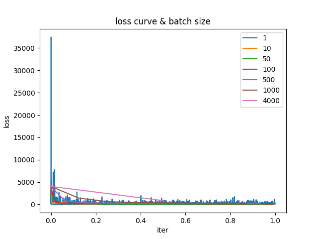
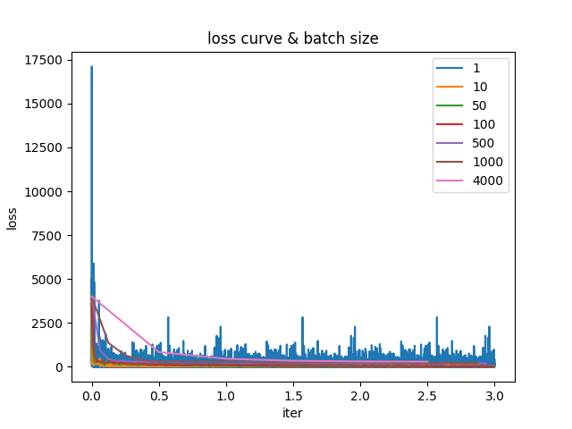
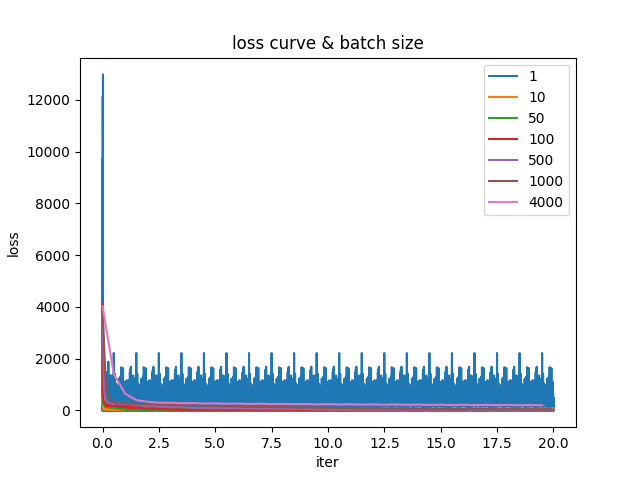
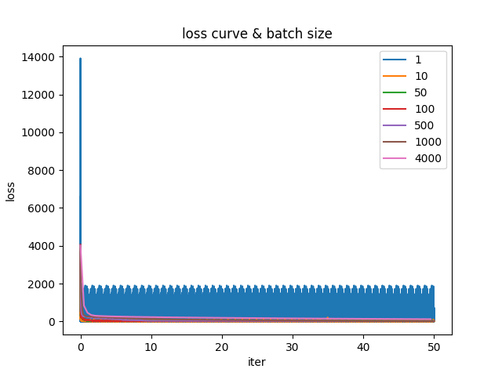
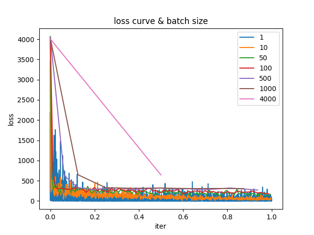
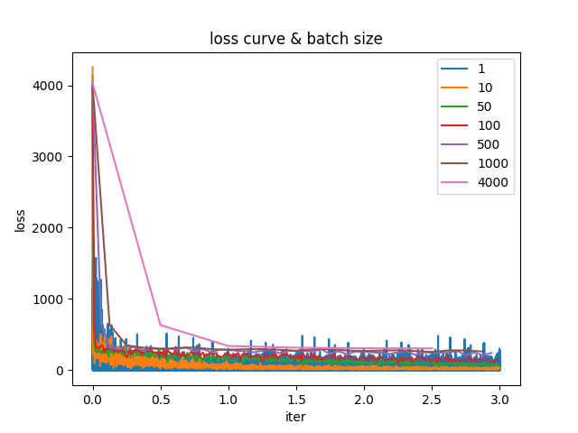
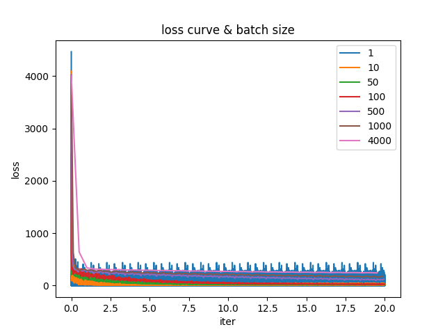
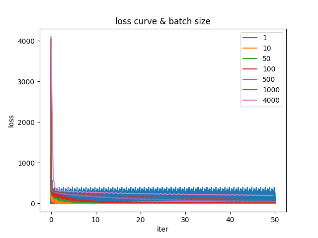
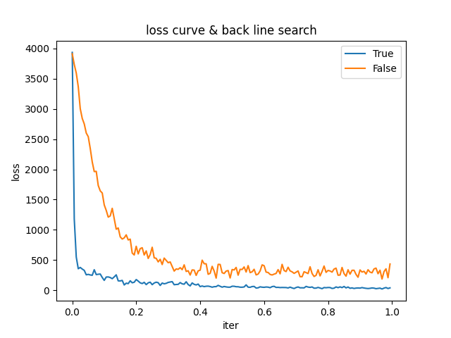
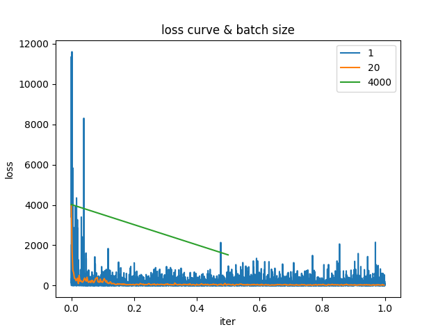

# mlbd2022fall-minibatch-sgd

Machine Learning & Big Data 2022 Fall homework 1: mini batch-sgd

https://github.com/keyork/mlbd2022fall-minibatch-sgd

## Usage

```
pip install numpy pandas matplotlib colorlog
python train.py -h
python train.py --args ...
```

## Task

- Using Mini-batch gradient descent for the example in slides 31-33

- Test the performances with different batch sizes

## Model

Four main parts: Dataloader, Linear Model, SGD, Back Line Search

### Dataloader

Using iteration in Python, randomly rearrange all data, load {batch size} data each time.

### Linear Model

Using array \* array in numpy directly instead of circulate, args is also a np.array: $\beta$.

### SGD

$$
\beta = \beta - learning\_ rate \cdot \frac{(f(x)-y)\cdot x}{batch\_ size}
$$

### Back Line Search

$$
loss(x+learning\_ rate\cdot \nabla loss(x))\leq loss(x)+c_1\cdot learning\_ rate\cdot (\nabla loss(x))^2
$$

$$
\nabla loss(x+learning\_ rate\cdot \nabla loss(x))\geq c_2 (\nabla loss(x))^2
$$

$$
0 \lt c_1 \lt c_2 \lt 1
$$

Search in the direction of getting smaller to get $lr_{max(temp)}$, then larger to get the true $lr_{max}$(if the initial value less than true $lr_{max}$), then smaller to get $lr_{min}$.

Set $lr = \sqrt{lr_{min}lr_{max}}$.

## Experiments

### Loss Curve & Batch Size

Set iteration = {1,3,20,50}, using back line search to ensure learning rate, set batch_size = {1,10,50,100,500,1000,4000}, record result and loss curve.



### Loss Curve & Back Line Search

Not using back line search, repeat the experiments.



### Ablation Experiment

remove bls, remove mini batch



### Analysis

The larger the batch size, the slower the model converges if others are the same. Back Line Search can ensure that the learning rate is appropriate to avoid divergences and allow the model to converge quickly.

## Result

We use the result by {iter=50, batch_size=50, back line search=True} as a good outcome:$\beta=[87.31551772, 8.87405893, 0.4220265, -1.78599689]$

$$
y=87.3+8.87x_1+0.42x_2-1.79x_3
$$
